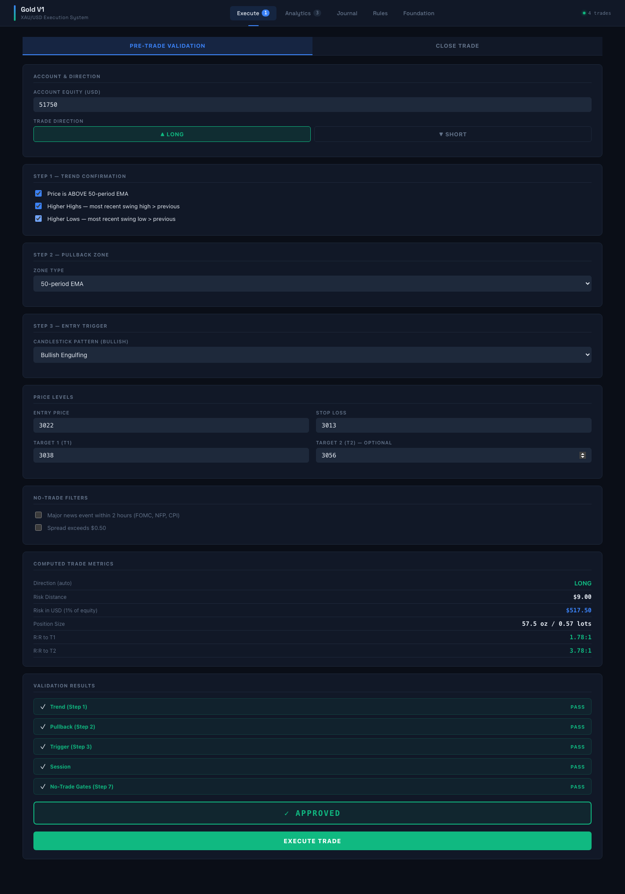
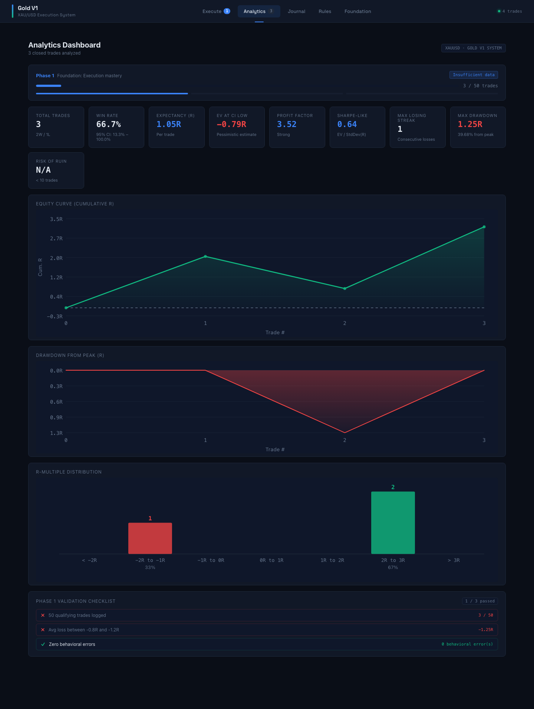
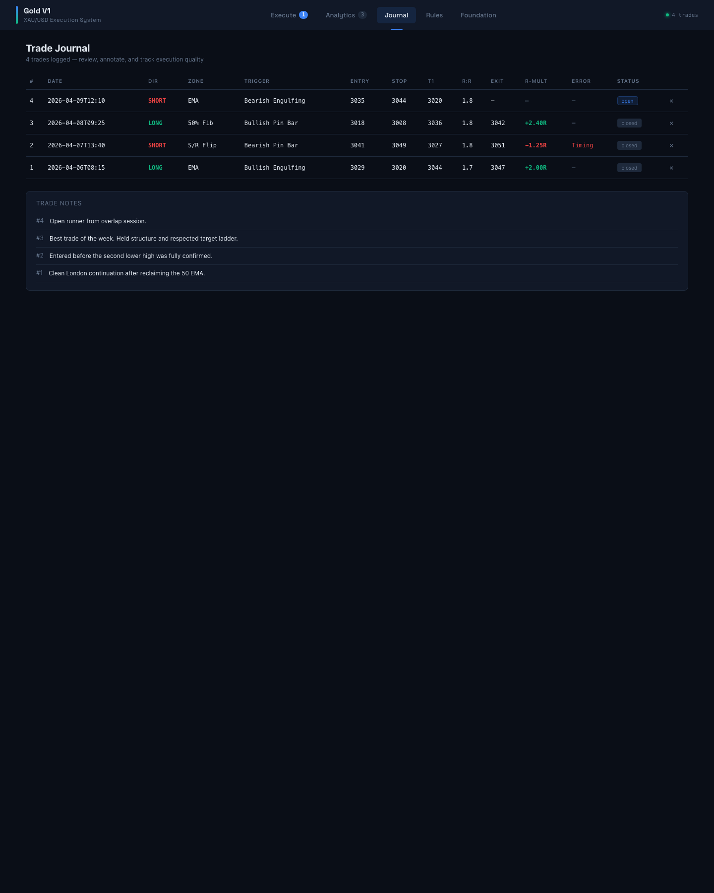
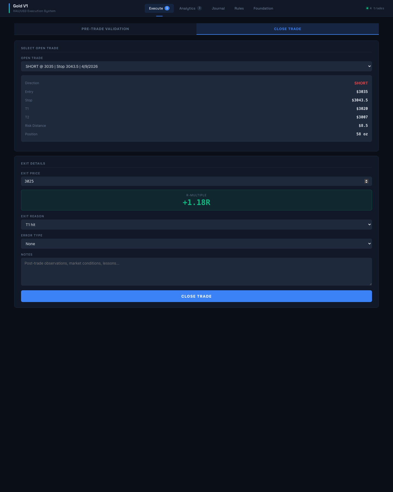
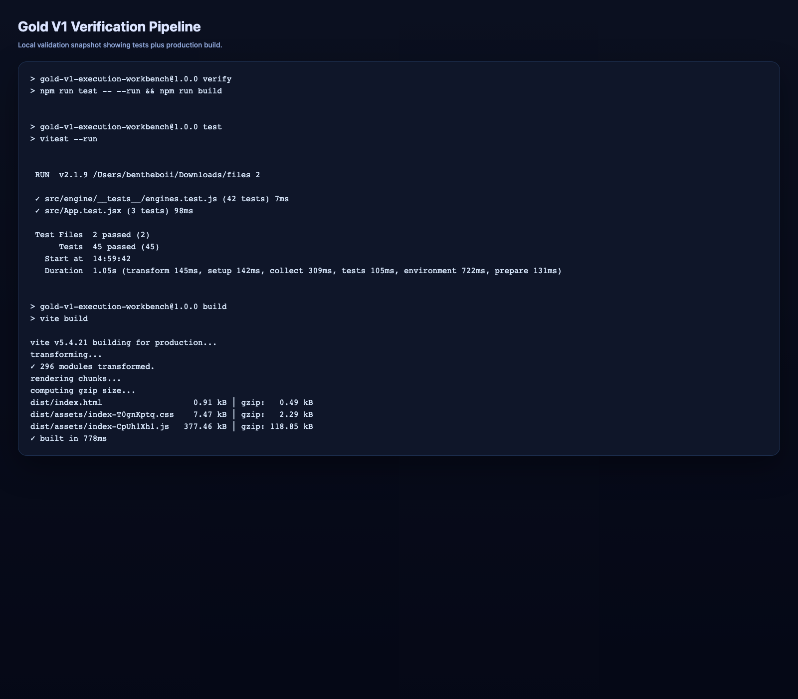

# Gold V1 Execution System

Gold V1 is a React + Vite trading workstation for the XAU/USD strategy stored in this repository. It turns the original authored assets into a runnable application with pre-trade validation, risk calculation, trade logging, analytics, and reference views for the rules and mathematical foundation.

This repository now contains both:

- the original source-of-truth strategy files
- the application layer that makes the system executable and reviewable

## What This Project Includes

### Original strategy assets

- `gold_v1_system_rules.json`
  The structured system definition that drives metadata, rules, no-trade conditions, and validation phases.
- `v1_system_and_math_foundation.md`
  The written mathematical and conceptual foundation for the system.
- `gold_v1_journal.jsx`
  The original authored journal source preserved in the repository as part of the strategy history.

### Added application layer

- React + Vite frontend
- multi-view interface for execution, analytics, journal, rules, and foundation
- deterministic validation engine for trade approval or rejection
- position sizing and R-multiple calculations
- persistent local trade storage via `localStorage`
- analytics dashboard for expectancy, drawdown, edge quality, and distribution
- automated tests for the core calculation and validation logic
- production build pipeline

## Screenshot Walkthrough

### 1. Execute view

The execution panel is where the trader validates a setup before taking a trade. It captures trend context, pullback zone, trigger type, price levels, and no-trade filters, then computes risk, reward, and position size.



### 2. Analytics dashboard

The analytics dashboard summarizes closed-trade performance using R-based math. It shows phase progress, expectancy, confidence intervals, drawdown, profit factor, risk of ruin, equity curve, and outcome distribution.



### 3. Journal view

The journal view lists logged trades in a structured table so execution quality can be reviewed over time. It surfaces direction, zone, trigger, entry, stop, target, exit, R-multiple, error classification, and notes.



### 4. Close trade flow

Open positions can be selected and closed through the close-trade workflow. The app recalculates realized R-multiple from the original entry/stop and the actual exit price, then stores the result for analytics and review.



### 5. Verification pipeline

The repository includes a verification command that runs the test suite and then produces a production build. The screenshot below captures the validation pipeline output used before publishing this version.



## Product Overview

The app is organized into five main views:

### Execute

This is the operational core of the project.

It lets the user:

- record directional bias as long or short
- validate trend conditions against the strategy definition
- choose the pullback zone
- choose the candlestick trigger
- enter entry, stop, T1, and optional T2
- apply no-trade filters such as major news and spread conditions
- compute risk distance, dollar risk, position size in ounces and lots, and reward-to-risk
- determine whether a trade is approved or blocked
- save approved trades to persistent storage

### Analytics

This view turns historical closed trades into measurable system performance.

It calculates:

- total trades
- win and loss count
- win rate and 95% confidence interval
- average win and average loss in R
- expected value per trade
- pessimistic EV at the confidence interval lower bound
- profit factor
- standard deviation of returns
- Sharpe-like ratio
- maximum losing streak
- maximum drawdown in both R and percent
- equity curve
- R-multiple distribution
- simplified risk-of-ruin estimate
- phase classification and edge status

### Journal

This view is the review surface for recorded trades.

It provides:

- sortable trade history by most recent first
- closed and open trade visibility
- error tagging
- notes review
- direct deletion of logged trades

### Rules

This view renders the system definition from `gold_v1_system_rules.json`, making the rules visible inside the application rather than keeping them buried as static data only.

### Foundation

This view renders the mathematical and conceptual foundation from `v1_system_and_math_foundation.md`, preserving the original written thesis while making it readable inside the app shell.

## End-to-End Workflow

The intended flow of the application is:

1. Open the `Execute` tab.
2. Assess trend direction and structural conditions.
3. Select the pullback zone and entry trigger.
4. Enter price levels.
5. Review automatically computed risk and reward metrics.
6. Let the validation engine determine whether the trade is approved.
7. Save the trade if it passes the rules.
8. Revisit open trades in the close-trade flow when they exit.
9. Review historical outcomes in the journal.
10. Evaluate the edge statistically in the analytics dashboard.

## Strategy Logic Implemented In Code

### Trade computation

`src/engine/tradeEngine.js` is responsible for the numerical mechanics of an individual trade.

It includes:

- `riskDistance(entry, stop)`
- `tradeDirection(entry, stop)`
- `positionSize(equity, entry, stop)`
- `riskRewardRatio(entry, stop, target)`
- `rMultiple(entry, stop, exitPrice)`
- `bufferedStop(direction, swingPrice, currentPrice)`
- `computeTrade(...)`
- `gateTrade(...)`

Important built-in assumptions:

- risk fraction is read from the JSON strategy rules
- max open positions is read from the JSON strategy rules
- minimum reward-to-risk to T1 is enforced at `1.5`
- gold lot sizing assumes `100 oz` per standard lot

### Validation pipeline

`src/engine/validationEngine.js` handles rule enforcement.

It validates:

- trend structure
- pullback zone selection
- trigger compatibility with direction
- session timing
- no-trade blockers

The aggregated function `validateTrade(...)` returns:

- overall approval status
- per-step pass/fail results
- all rejection reasons
- detected session label

### Analytics engine

`src/engine/mathEngine.js` computes performance analytics from arrays of closed-trade R-multiples.

This module includes:

- expectancy
- confidence interval around win rate
- average return
- standard deviation
- profit factor
- equity curve
- drawdown series
- risk of ruin
- losing streak
- distribution buckets
- phase and edge-status classification

## Data Persistence

Trade and settings data are stored in browser `localStorage`.

`src/data/tradeStore.js` manages:

- loading and saving trades
- loading and saving account settings
- adding, updating, and deleting trades
- deriving closed and open trades
- current drawdown calculation
- migration from the older `gold_v1_journal` storage format

Storage keys:

- `gold_v1_trades`
- `gold_v1_settings`

This means the app works without a backend, but trade data is local to the browser profile being used.

## Application Architecture

### Main shell

- `src/App.jsx`
  Top-level shell, navigation, view switching, trade loading, and refresh coordination.

### UI components

- `src/components/TradeExecutionPanel.jsx`
  Pre-trade validation and close-trade execution UI.
- `src/components/AnalyticsDashboard.jsx`
  Performance metrics, charts, and edge-tracking UI.
- `src/components/JournalPanel.jsx`
  Logged trade table and notes display.
- `src/components/RulesPanel.jsx`
  Strategy rule rendering.
- `src/components/FoundationPanel.jsx`
  Mathematical foundation rendering.
- `src/components/OverviewPanel.jsx`
  Earlier overview component retained in the repository.

### Data and rules

- `src/data/strategy.js`
  Adapts the JSON rules and markdown foundation into app-friendly exports.
- `src/data/tradeStore.js`
  Local persistence layer for trades and settings.

### Engines

- `src/engine/tradeEngine.js`
  Trade math and gating.
- `src/engine/validationEngine.js`
  Strategy rule validation.
- `src/engine/mathEngine.js`
  Historical analytics calculations.

### Testing

- `src/engine/__tests__/engines.test.js`
  Core unit tests for trading math and validation logic.
- `src/App.test.jsx`
  App shell rendering and navigation behavior tests.
- `src/test/setup.js`
  Test environment setup.

## Local Development

### Install dependencies

```bash
npm install
```

### Start the development server

```bash
npm run dev
```

This launches the Vite development server.

### Run tests

```bash
npm run test -- --run
```

This runs the Vitest suite once in non-watch mode.

### Run the full verification pipeline

```bash
npm run verify
```

This runs:

1. the test suite
2. the production build

That command is the fastest way to confirm the repository is in a shippable state.

## Build Output

Production bundles are emitted into:

- `dist/`

The current app is built with:

- Vite
- React 18
- Vitest
- Testing Library
- `react-markdown`
- `remark-gfm`

## Current Test Coverage Focus

The tests in this repository currently focus on:

- risk and sizing calculations
- reward-to-risk calculations
- R-multiple calculations
- validation logic for trend, trigger, sessions, and blockers
- app-shell rendering
- view switching behavior

## Why This Repository Matters

This repo is more than a static strategy dump. It now acts as:

- a documented strategy archive
- a trading execution checklist
- a persistent trade journal
- a lightweight analytics engine
- a reproducible testable frontend project

In short, the repo turns a strategy into a usable operating system for discretionary execution.

## Notes

- This app stores data locally in the browser and does not sync to a backend.
- The analytics dashboard depends on closed trades with valid `rMultiple` values.
- The journal migration logic protects existing new-format trade data from being overwritten.
- The screenshots in this README were generated from the running app and committed into `docs/images` so they render correctly on GitHub.

## Disclaimer

This project is an execution and analysis tool for a specific trading methodology. It is not financial advice, does not guarantee performance, and should be used with appropriate risk controls and independent judgment.
