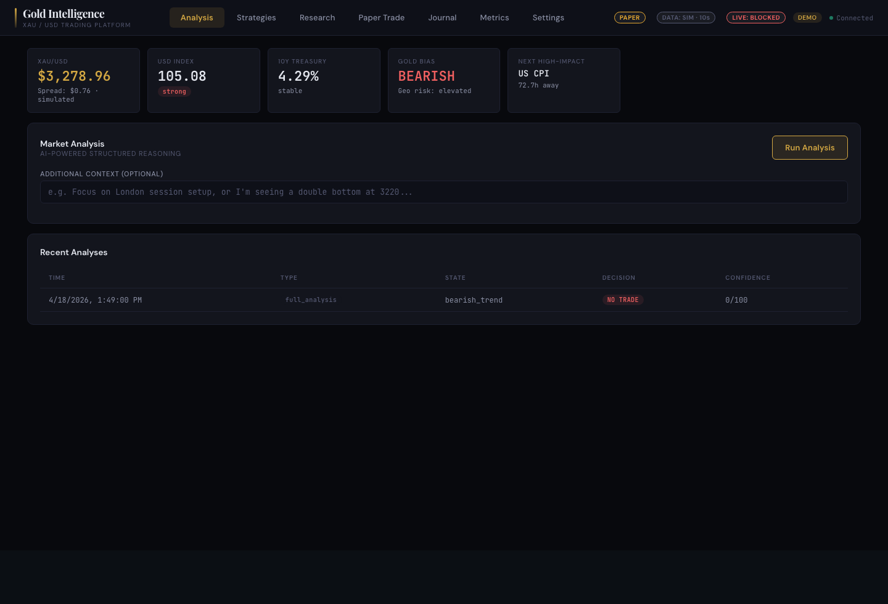
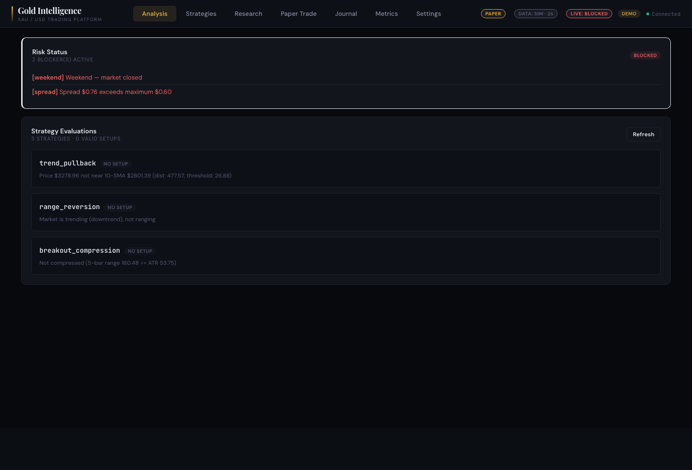
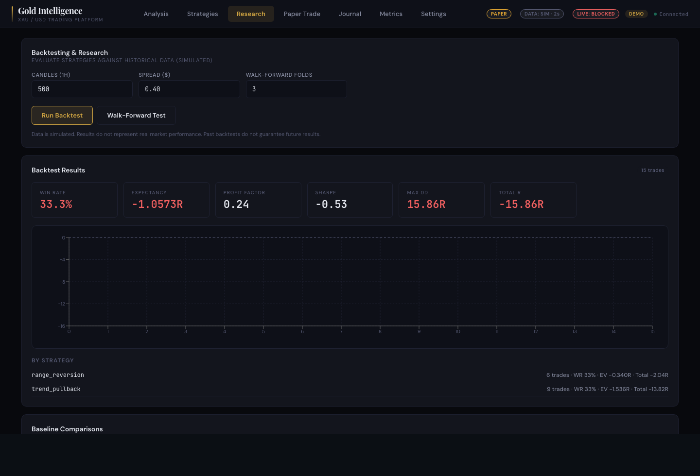
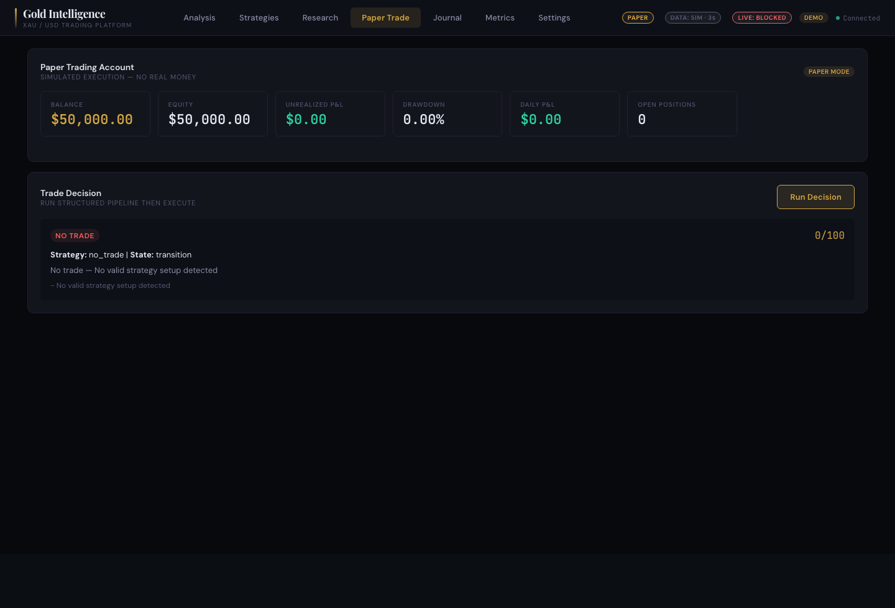
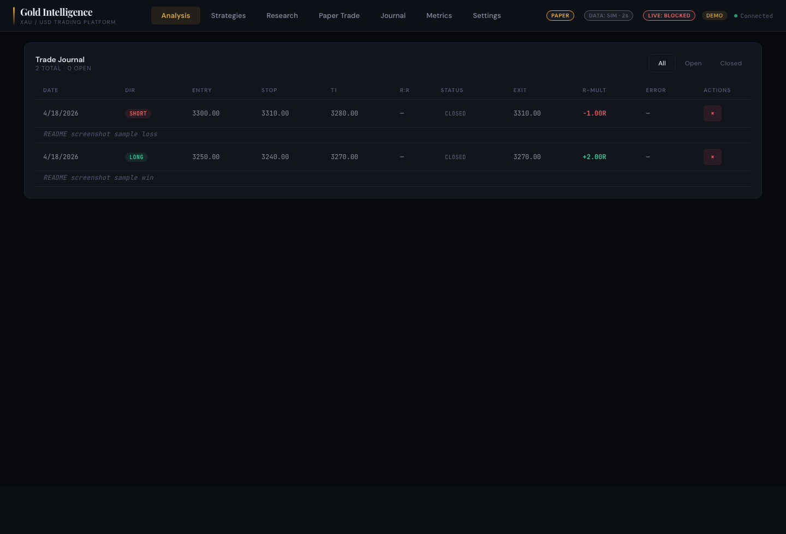
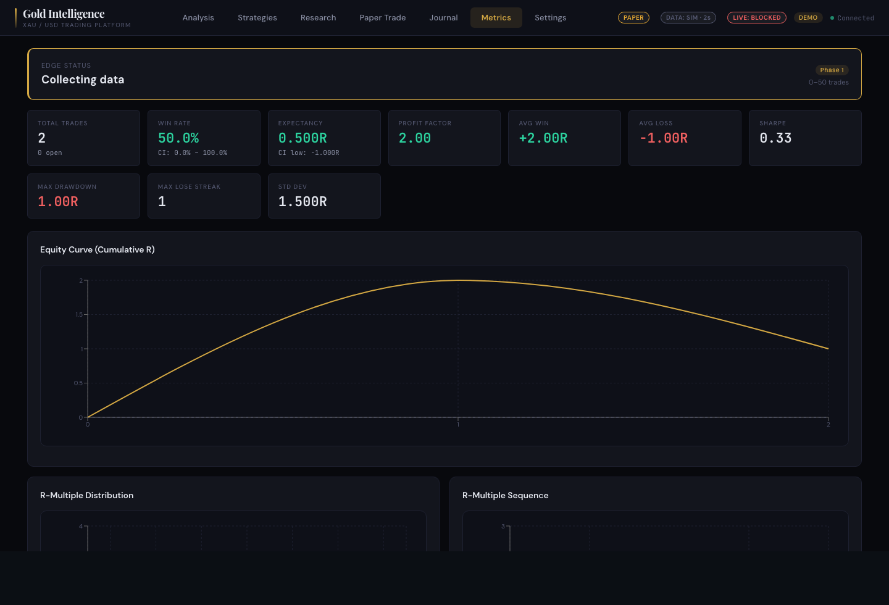
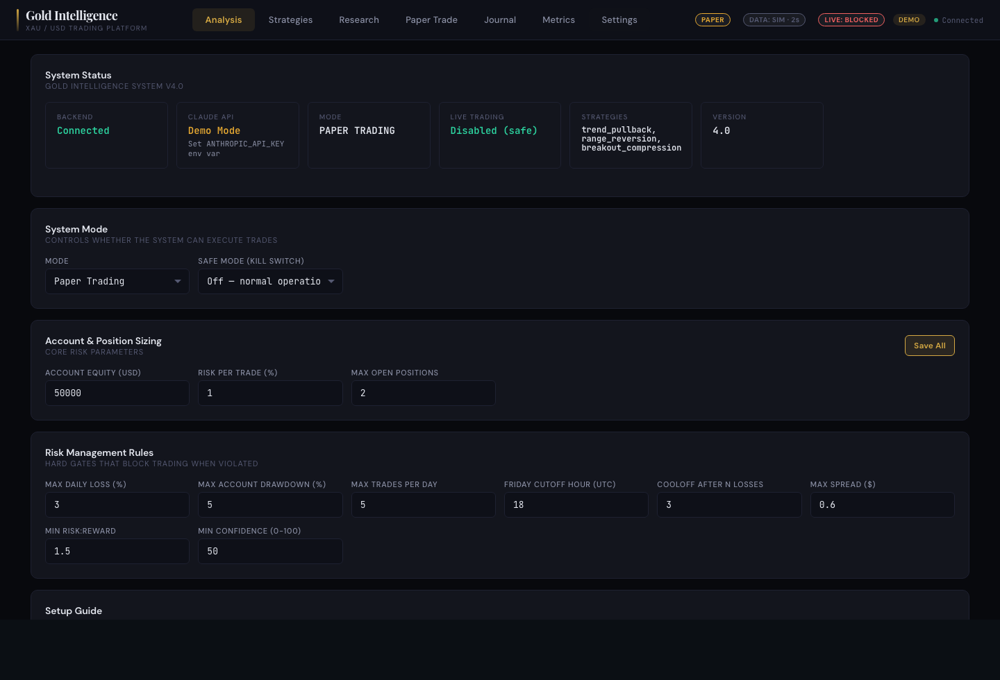

# Gold Market Intelligence System v4.0 (Phase 3)

A local XAU/USD research and paper-trading platform with optional Claude-powered decisioning.

**Default mode is simulated data + paper trading.** Phase 3 closes the code gaps
identified at the end of Phase 2: the OANDA market-data and broker adapters
are now implemented against the v20 REST API using only the Python stdlib, a
FRED-backed macro provider and file-backed economic calendar provider are
available, multi-user API tokens replace the single shared token, and a
Dockerfile + nginx TLS guide make the deployment posture explicit. **Every
HTTP path is mock-tested** and every real-data adapter refuses to silently
fall back to simulated data.

Two gaps remain that cannot be closed in code alone:
1. **Live validation of the OANDA adapters** requires running for at least
   one trading week against a real practice account with manual reconciliation
   against the OANDA web UI. See `deploy/README.md` for the supervised dry-run
   checklist.
2. **Strategy edge validation** requires running research-mode backtests
   against 6+ months of real OHLC data (imported via the Phase 2 import path).

Until both are done, **do not** flip `OANDA_ENVIRONMENT` from `practice` to
`live`. The readiness gate will not stop you if you explicitly enable
everything; it will only stop you from accidentally doing so.

## Screenshots

Captured from this repo running locally on April 18, 2026 in its default simulated-data, paper-trading mode.

### Analysis Workspace



### Strategy Evaluation



### Strategy Research



### Paper Trading Decision Flow



### Journal And Metrics





### Settings



## What This System Is

- A **research platform** for evaluating gold trading strategies against simulated data
- A **paper trading engine** that simulates order execution without real money
- A **structured decision pipeline** that uses deterministic strategies with optional AI ranking
- A **trade journal** with performance analytics and self-improvement feedback
- A **backtesting framework** with walk-forward analysis and baseline comparisons

## What This System Is NOT

- **Not a proven profitable system** -- strategy edge is an empirical question requiring real out-of-sample evaluation
- **Not a magic AI trading bot** -- Claude assists with ranking and explanation; deterministic rules, risk gates, and backtesting are the actual system
- **Not approved for real-money live trading** -- the OANDA adapters are implemented and mock-tested but have NOT been validated against the live service in this build; by default live cutover is blocked by an explicit acknowledgement gate (see `deploy/README.md`)
- **Not a substitute for operator supervision** -- every live order still flows through a deterministic readiness gate, but you are the last line of defense

## Native Run

These instructions are for running the app directly on your machine without Docker.

### Requirements

- Python 3.10+
- Node.js 18+
- npm 9+

### 1. Start the backend

From the project root:

```bash
cd backend
python3 server.py
```

The backend starts on `http://127.0.0.1:8888`.

### 2. Start the frontend

In a second terminal:

```bash
cd frontend
npm install
npm run dev
```

The frontend starts on `http://127.0.0.1:5173` by default.

### 3. Open the app

Open:

- [http://127.0.0.1:5173](http://127.0.0.1:5173)

### 4. Optional: run the test suite first

From the project root:

```bash
python3 -m pytest backend -q
cd frontend && npm test -- --run
```

### 5. Optional: production frontend build

```bash
cd frontend
npm run build
```

### 6. Secrets and local env files

- `.env`, `.env.local`, and related local secret files are already ignored by [`.gitignore`](/Users/bentheboii/Downloads/gold_agent/.gitignore:1).
- Keep real credentials local only.
- If you create any env files for OANDA, Anthropic, or auth tokens, do not commit them.

## Quick Start

```bash
# 1. Start backend (Python 3.10+, no pip dependencies for core)
cd backend && python3 server.py

# 2. Start frontend (separate terminal)
cd frontend && npm install && npm run dev

# 3. Open http://localhost:5173
```

By default, the backend binds to `127.0.0.1:8888` (localhost only). The API is open with no authentication required in local dev mode. See [Deployment](#deployment) for non-local use.

### Enable Claude-Powered Analysis

```bash
export ANTHROPIC_API_KEY=sk-ant-your-key-here
python3 backend/server.py
```

Without an API key, the system runs in **demo mode** with rule-based analysis. All deterministic features (strategies, backtesting, paper trading, risk management) work without an API key.

## What's New in Phase 2

| Area | Phase 1 | Phase 2 |
|------|---------|---------|
| Data providers | hard-coded simulated | factory selectable via `DATA_PROVIDER`, OANDA adapter skeleton, freshness/source/age in every quote |
| Historical backtests | synthetic candles only | CSV/JSON import (`POST /api/backtest/historical`), validated, no-lookahead replay |
| Live broker | bare skeleton, raised on construct | gated adapter: env enable + config validation + readiness gate; `submit_order` blocked by deterministic checks |
| Health | basic status | exposes `data_source`, `data_is_real`, `data_provider_ready`, `last_quote_age_seconds`, `live_ready`, `live_blocker_rules`, `claude_available`, `paper_available` |
| New endpoints | — | `GET /api/readiness`, `GET /api/historical/list`, `POST /api/backtest/historical` |
| Frontend | mode badge | `DATA: SIM` / `DATA: REAL · Ns` and `LIVE: BLOCKED/READY` badges; tooltip lists hard blocker rules |
| Audit | decision log | every decision now persists `data_provenance` (provider, kind, is_real, quote source/timestamp) |
| Tests | 82 backend, 49 frontend | **117 backend, 49 frontend** (Phase 2 added 35) |

## What's New in Phase 3

| Area | Phase 2 | Phase 3 |
|------|---------|---------|
| HTTP for real-data adapters | none | `backend/core/http_client.py`: stdlib-only urllib wrapper with retry/backoff/jitter, injectable opener for mocking, clean 401/429/5xx/network exception hierarchy (never retries auth or 4xx) |
| OANDA market data | skeleton, `NotImplementedError` | `RealOandaMarketDataProvider`: real calls against `/v3/accounts/{id}/pricing` + `/v3/instruments/{}/candles`, maps granularity, skips incomplete candles (no lookahead), falls back to `closeoutBid/Ask` if top-of-book missing, no silent fallback on error |
| OANDA live broker | skeleton | `OandaLiveBroker(LiveBroker)`: real calls against `/orders`, `/trades/{id}/close`, `/openTrades`, `/accounts/{id}`, `/transactions?type=ORDER_FILL`; enforces readiness gate on every action; units conversion documented (1 lot = 100 oz) |
| Macro provider | simulated | `FredMacroProvider`: DXY (DTWEXBGS) + 10Y (DGS10) + CPI (CPIAUCSL) + VIX (VIXCLS), 1h in-memory cache, regime derivation, no silent fallback |
| Calendar provider | simulated recurring events | `FileCalendarProvider`: operator-curated JSON at `CALENDAR_FILE`, strict validation, fail-closed blackout (if file unreadable, treat as blackout), auto-filters past events |
| Auth | single shared token | multi-user tokens via `API_TOKENS_FILE` with scopes, constant-time compare, mtime-cached rotation without restart, audit ring buffer at `GET /api/auth/audit`, fail-closed on malformed file |
| Deployment | "use a reverse proxy" | `Dockerfile` (non-root, healthcheck, stdlib-only) + `deploy/nginx.conf.example` (TLS 1.2/1.3, HSTS, CSP, rate limit hooks) + `deploy/README.md` with the supervised dry-run checklist |
| Tests | 117 backend | **149 backend, 49 frontend** (Phase 3 added 32: 6 http_client, 6 OANDA market, 5 OANDA broker, 2 broker status, 3 FRED, 3 file-calendar, 7 auth) |

## Testing

### Backend Tests (149 tests)

```bash
# Unit tests (54 tests)
python3 backend/test_server.py

# HTTP endpoint tests (25 tests, including auth)
python3 backend/test_http.py

# End-to-end integration tests (3 tests)
python3 backend/test_e2e.py

# Phase 2: provider seam, historical import, live gating, readiness (35 tests)
python3 -m pytest backend/test_phase2.py -v

# Phase 3: real HTTP adapters, multi-user auth, OANDA broker (32 tests; all mocked)
python3 -m pytest backend/test_phase3.py -v

# All together via pytest
python3 -m pytest backend -q
```

### Frontend Tests (49 tests)

```bash
cd frontend && npm test
```

### Run a Backtest

```bash
# Synthetic candles (default)
curl -X POST http://localhost:8888/api/backtest \
  -H "Content-Type: application/json" \
  -d '{"candles": 500, "spread": 0.40}'

# Walk-forward analysis
curl -X POST http://localhost:8888/api/backtest/walk-forward \
  -H "Content-Type: application/json" \
  -d '{"candles": 500, "folds": 3}'

# Phase 2: real historical OHLC import (drop a CSV/JSON in backend/data/historical/)
curl http://localhost:8888/api/historical/list
curl -X POST http://localhost:8888/api/backtest/historical \
  -H "Content-Type: application/json" \
  -d '{"filename": "xauusd_1h.csv", "timeframe": "1h", "spread": 0.40}'
```

Or use the **Research** tab in the frontend.

## Historical Data Import (Phase 2)

Drop OHLC files into `backend/data/historical/` and reference them by basename. Path traversal is rejected at the API boundary.

**CSV format** (header required, case-insensitive):
```
timestamp,open,high,low,close,volume
2024-01-15T10:00:00Z,2050.10,2052.50,2048.30,2051.40,1234
2024-01-15T11:00:00Z,2051.40,2053.20,2049.80,2050.90,1102
```

**JSON format**: a list of objects with the same fields.

**Accepted timestamp formats**: ISO-8601 with timezone, ISO-8601 without timezone (assumed UTC), Unix epoch seconds, Unix epoch milliseconds (>1e12).

**Validation rules** (rows are rejected with a clean error):
- All required fields present (`timestamp,open,high,low,close`; volume optional)
- `high >= low`, `open` and `close` inside `[low, high]`, all prices > 0
- Timestamps parseable, sorted ascending, no duplicates
- Timeframe is one of `1m, 5m, 15m, 30m, 1h, 4h, 1d`

The backtest engine consumes imported candles deterministically with no lookahead bias.

## Real Data Provider Seam (Phase 2)

`DATA_PROVIDER` env var selects the active market provider:

| Value | Kind | Behavior |
|-------|------|----------|
| `simulated` (default) | simulated | safe for research/paper; **never acceptable for live execution** |
| `oanda` | real | Phase 3 adapter (`backend/providers/oanda_market.py`): real v20 `pricing` + `candles` calls with retry/backoff; requires `OANDA_API_KEY`, `OANDA_ACCOUNT_ID`, `OANDA_ENVIRONMENT`; **does NOT silently fall back to simulated on error** |
| `historical_csv` | replay | constructed directly via `backend.providers.historical_data.load_candles()`, not env-selectable |

Server startup picks `DATA_PROVIDER` from env. If a real provider is requested but its config is missing, the server falls back to simulated **for research/paper only** and records the reason in `/api/health`. **Live execution always blocks against a simulated provider** — see live-readiness gating below.

Every quote includes `source`, `timestamp`, and a `is_simulated` flag. Every provider exposes `get_status()` returning `{name, kind, is_real, ready, last_quote_age_seconds, reason}`, surfaced in `/api/health` and `/api/readiness`.

## Live-Trading Readiness Gate (Phase 2)

Live execution requires **all** of the following — checked deterministically before any order is routed:

1. `LIVE_BROKER_ENABLED=true`
2. `system_mode` is `"live"` in settings
3. `safe_mode` is off
4. Active data provider is real (`is_real=true`) and ready
5. Last quote age ≤ `stale_data_seconds` (default 300s)
6. Live broker adapter is implemented for the selected `LIVE_BROKER` (Phase 3: `oanda` is implemented; adding another broker means registering it in `_IMPLEMENTED_BROKERS`)
7. No risk-engine hard blockers (weekend, news blackout, drawdown, daily loss, etc.)
8. **Phase 3 addition**: if `OANDA_ENVIRONMENT=live`, `LIVE_CUTOVER_ACKNOWLEDGED=true` must be set by the operator after completing the supervised practice-account validation in `deploy/README.md`

If any check fails, `LiveBroker.submit_order()` raises `LiveExecutionBlocked` with the full report. **There is no silent fallback to paper.** The gate is a single function (`evaluate_live_readiness`) so the same logic powers `/api/health`, `/api/readiness`, the broker, and tests.

`/api/readiness` returns the full report with all hard blockers, the active provider status, the broker status, and the current risk blockers. The frontend badge surfaces a summary in the topbar.

**Current honest status of live trading (Phase 3):** all gating is implemented and tested; `OandaLiveBroker` now has real HTTP glue via `backend/core/http_client.py` and the OANDA market data adapter returns real `pricing` / `candles` responses. **Neither has been run against the live OANDA service in this build.** The remaining gap is *validation*, not code: see `deploy/README.md` for the supervised practice-account dry-run checklist that must pass before any real-money cutover.

## Deployment (Phase 3)

For non-local deployment, see `deploy/README.md`. Summary:

- Run the backend in the provided `Dockerfile` (non-root, stdlib-only).
- Put `nginx` in front with TLS 1.2/1.3 (`deploy/nginx.conf.example`).
- Use multi-user auth via `API_TOKENS_FILE` (≥16-char tokens, unique per
  principal, rotatable without restart; fail-closed on malformed file).
- Complete the supervised dry-run checklist before flipping
  `OANDA_ENVIRONMENT=live`.

## Deployment

### Local Development (Default)

No configuration needed. The server binds to `127.0.0.1`, CORS is open, and no auth is required.

### Non-Local / Deployed Use

For any deployment beyond localhost, set these environment variables:

```bash
# Required: API authentication token (any strong random string)
export API_AUTH_TOKEN="your-secret-token-here"

# Recommended: restrict CORS to your frontend origin(s)
export CORS_ALLOWED_ORIGINS="https://your-app.example.com"

# Optional: bind to all interfaces (required for containers/VMs)
export BIND_HOST="0.0.0.0"
```

When `API_AUTH_TOKEN` is set:
- All endpoints except `GET /api/health` require `Authorization: Bearer <token>`
- `GET /api/health` remains public for load balancer health checks
- Requests without a valid token receive `401 Unauthorized`

When `CORS_ALLOWED_ORIGINS` is set:
- Only listed origins receive CORS headers (comma-separated)
- Unlisted origins are blocked by the browser

The server will warn at startup if bound to `0.0.0.0` without `API_AUTH_TOKEN`.

**Important:** This is a stdlib `http.server` -- it is single-threaded and has no TLS. For production deployment, place it behind a reverse proxy (nginx, Caddy, etc.) that handles TLS termination and connection management.

## Architecture

```
Frontend (React + Vite)              Backend (Python stdlib)
+-------------------------+         +------------------------------------+
| Analysis Panel          |         | Providers (market, calendar, macro) |
| Strategies Panel        |  HTTP   | Feature Engine (deterministic)      |
| Research/Backtest Panel |<------->| Strategy Registry (3 strategies)    |
| Paper Trading Panel     |  JSON   | Risk Engine (hard gates)            |
| Journal Panel           |         | Decision Engine (Claude optional)   |
| Metrics Panel           |         | Paper Broker (execution sim)        |
| Settings Panel          |         | Backtest Engine (walk-forward)      |
+-------------------------+         | Memory Store (audit trail)          |
                                    | REST API (25+ endpoints)            |
                                    +------------------------------------+
```

## Backend Module Structure

```
backend/
  server.py                  # HTTP server + endpoint routing + auth
  test_server.py             # 54 unit tests covering all modules
  test_http.py               # 25 HTTP-level endpoint tests (including auth)
  test_e2e.py                # 3 end-to-end integration tests
  requirements-dev.txt       # Dev dependencies (pytest)
  core/
    time_utils.py            # Timezone-aware UTC, session detection
    schemas.py               # Validation for trades, decisions, settings
    validation.py            # HTTP request validation utilities
  providers/
    market_data.py           # Market data provider interface + simulated
    calendar_data.py         # Economic calendar interface + simulated
    macro_data.py            # Macro context interface + simulated
  features/
    market_features.py       # Deterministic feature engine (ATR, trend, S/R, etc.)
  strategies/
    base.py                  # Strategy base class + SetupResult
    trend_pullback.py        # Trend pullback continuation strategy
    range_reversion.py       # Range fade / mean reversion strategy
    breakout_compression.py  # Breakout after compression strategy
    registry.py              # Strategy registry + evaluation
  risk/
    engine.py                # Risk management engine with configurable rules
  execution/
    broker_base.py           # Broker adapter interface
    paper_broker.py          # Paper broker (simulated execution)
    live_broker.py           # LiveBroker base + readiness gate; refuses to route on the abstract class
    oanda_broker.py          # Phase 3: OandaLiveBroker — real v20 REST order routing (mock-tested, unvalidated live)
  backtest/
    engine.py                # Backtest engine + walk-forward analysis
    metrics.py               # Comprehensive backtest metrics
    baselines.py             # No-trade and random baselines for comparison
  agent/
    decision_schema.py       # Claude output schema + validation
    prompt_builder.py        # Structured prompt construction
    decision_engine.py       # Full decision pipeline orchestrator
  memory/
    store.py                 # Decision memory with audit trail
    experiments.py           # Experiment version tracking
```

## Paper Trading / Journal Integration

Paper trades automatically create and update journal entries:
- **Opening a paper trade** creates a journal entry with `source: "paper_broker"` and the `paper_position_id`
- **Closing a paper position** updates the corresponding journal entry with exit price and R-multiple
- **Manual journal entries** (via the Trade Planning tab) remain independent -- they are not tracked by the paper broker

The Journal tab shows all trades (both paper and manual), and Metrics are computed from all journal entries regardless of source.

## Key Interfaces

### Provider Interface

All data providers implement abstract interfaces. Replace simulated providers with real ones by implementing:

```python
class MarketDataProvider(abc.ABC):
    def get_quote(self) -> dict: ...
    def get_candles(self, timeframe, count, end_time) -> List[dict]: ...
    def get_spread(self) -> float: ...
```

### Strategy Interface

```python
class BaseStrategy(abc.ABC):
    name: str
    required_timeframes: List[str]
    def evaluate(self, features, candles) -> SetupResult: ...
```

### Broker Interface

```python
class BaseBroker(abc.ABC):
    def submit_order(self, order) -> dict: ...
    def close_position(self, position_id, price) -> dict: ...
    def get_positions(self) -> List[BrokerPosition]: ...
    def get_account(self) -> dict: ...
    def is_live(self) -> bool: ...
```

## Risk Management

Hard gates that block trading when any condition is violated:

| Rule | Default | Description |
|------|---------|-------------|
| Safe mode | Off | Kill switch -- blocks all trading |
| Weekend | Auto | Saturday/Sunday blocked |
| Friday cutoff | 18:00 UTC | Blocks Friday evening for weekend gap risk |
| Off-hours session | Auto | Outside Asia/London/NY sessions |
| News blackout | Auto | High-impact event within 2 hours |
| Max spread | $0.60 | Wide spread protection |
| Max positions | 2 | Limits concurrent exposure |
| Max daily trades | 5 | Prevents overtrading |
| Max drawdown | 5% | Account drawdown circuit breaker |
| Max daily loss | 3% | Daily loss limit |
| Loss cooloff | 3 | Pause after consecutive losses |
| Min R:R | 1.5:1 | Minimum risk:reward ratio |
| Min confidence | 50 | Minimum confidence score |

## API Endpoints

`GET /api/health` is always public. All other endpoints require `Authorization: Bearer <token>` when `API_AUTH_TOKEN` is set.

### Core Data
| Method | Path | Description |
|--------|------|-------------|
| GET | /api/health | System status, auth, provider readiness, live blockers (public) |
| GET | /api/readiness | Full live-readiness report with all blockers (Phase 2) |
| GET | /api/historical/list | List importable OHLC files (Phase 2) |
| POST | /api/backtest/historical | Run backtest from imported CSV/JSON (Phase 2) |
| GET | /api/price | Current XAU/USD quote (simulated) |
| GET | /api/macro | Macroeconomic context (simulated) |
| GET | /api/calendar | Economic calendar (simulated) |
| GET | /api/structure | Legacy market structure |
| GET | /api/features | Computed market features |
| GET | /api/strategies | Strategy evaluation results |
| GET | /api/risk | Risk blocker status |

### Decision & Execution
| Method | Path | Description |
|--------|------|-------------|
| POST | /api/analyze | Legacy Claude/demo analysis |
| POST | /api/decide | Structured decision pipeline |
| POST | /api/paper/execute | Execute paper trade from decision |
| POST | /api/paper/close | Close paper position |
| GET | /api/paper/account | Paper account state |
| GET | /api/paper/positions | Open paper positions |
| GET | /api/paper/fills | Recent paper fills |

### Research
| Method | Path | Description |
|--------|------|-------------|
| POST | /api/backtest | Run backtest with baselines |
| POST | /api/backtest/walk-forward | Walk-forward analysis |
| GET | /api/experiments | Experiment history |
| GET | /api/decisions | Decision history with audit trail |
| GET | /api/decisions/analysis | Claude vs deterministic comparison |

### Journal & Metrics
| Method | Path | Description |
|--------|------|-------------|
| GET | /api/trades | Trade history |
| POST | /api/trades | Log trade |
| PUT | /api/trades/:id | Update trade |
| DELETE | /api/trades/:id | Delete trade |
| GET | /api/metrics | Performance analytics |
| GET | /api/settings | Settings |
| POST | /api/settings | Update settings |

## Environment Variables

| Variable | Default | Description |
|----------|---------|-------------|
| ANTHROPIC_API_KEY | (none) | Enables Claude-powered analysis |
| PORT | 8888 | Backend port |
| BIND_HOST | 127.0.0.1 | Bind address (set to 0.0.0.0 for non-local) |
| DATA_DIR | `backend/data/` | Persistent storage directory |
| API_AUTH_TOKEN | (none) | Legacy single shared token. All endpoints except `/api/health` require Bearer auth when set. Superseded by `API_TOKENS_FILE` in Phase 3. |
| API_TOKENS_FILE | (none) | Path to a JSON file of `{token, principal, scopes}` entries for multi-user auth. Tokens must be ≥16 chars, unique. File is re-read on every check (mtime-cached). Fail-closed if malformed. See `deploy/README.md`. |
| CORS_ALLOWED_ORIGINS | (none) | If set, restricts CORS to listed origins (comma-separated) |
| DATA_PROVIDER | simulated | `simulated` (default), `oanda` (Phase 3: real urllib-backed adapter, requires creds) |
| OANDA_API_KEY | (none) | Required if DATA_PROVIDER=oanda or LIVE_BROKER=oanda |
| OANDA_ACCOUNT_ID | (none) | Required if DATA_PROVIDER=oanda or LIVE_BROKER=oanda |
| OANDA_ENVIRONMENT | practice | `practice` or `live` — stay on `practice` until the supervised dry-run in `deploy/README.md` passes |
| OANDA_INSTRUMENT | XAU_USD | OANDA instrument symbol |
| MACRO_PROVIDER | simulated | `simulated` (default), `fred` (Phase 3, requires `FRED_API_KEY`) |
| FRED_API_KEY | (none) | Required if MACRO_PROVIDER=fred. Free key: https://fred.stlouisfed.org/docs/api/api_key.html |
| FRED_DXY_SERIES / FRED_RATE10_SERIES / FRED_CPI_SERIES / FRED_VIX_SERIES | DTWEXBGS / DGS10 / CPIAUCSL / VIXCLS | Override FRED series IDs if you want a different proxy |
| CALENDAR_PROVIDER | simulated | `simulated` (default), `file` (Phase 3, reads `CALENDAR_FILE`) |
| CALENDAR_FILE | data/calendar.json | JSON list of economic events when CALENDAR_PROVIDER=file |
| CALENDAR_BLACKOUT_HOURS | 2 | Minutes before/after a high-impact event to treat as news blackout |
| LIVE_BROKER_ENABLED | false | Must be "true" to construct LiveBroker |
| LIVE_BROKER | oanda | Selected live broker adapter (Phase 3: `oanda` is implemented but unvalidated against the live service) |
| LIVE_CUTOVER_ACKNOWLEDGED | false | Must be "true" to allow live execution against `OANDA_ENVIRONMENT=live`. Flip this ONLY after completing the supervised practice-account validation in `deploy/README.md` §5. Has no effect in practice mode. |

## Live Trading Safety

Live trading is **implemented but unvalidated** in Phase 3. `OandaLiveBroker`
in `backend/execution/oanda_broker.py` routes real OANDA v20 REST orders
when explicitly enabled, and the readiness gate refuses to route against
simulated data, a stale feed, safe-mode, or any hard risk blocker.

To go live (practice account only until you complete the dry-run checklist):

1. `export LIVE_BROKER_ENABLED=true LIVE_BROKER=oanda`
2. `export OANDA_API_KEY=... OANDA_ACCOUNT_ID=... OANDA_ENVIRONMENT=practice`
3. `export DATA_PROVIDER=oanda` so the gate sees real data.
4. Set `system_mode=live` in `/api/settings`.
5. Run the full supervised dry-run in `deploy/README.md` (section 5).
6. Only after all checklist items pass: consider a gated rollout to
   `OANDA_ENVIRONMENT=live` **and** set `LIVE_CUTOVER_ACKNOWLEDGED=true` as
   the final step, with reduced position sizes.

The system makes it **hard to accidentally go live**:
- `LIVE_BROKER_ENABLED=true` must be set explicitly.
- `system_mode` must be `live` (not `paper_trading`).
- `DATA_PROVIDER` must be a real provider (simulated blocks the gate).
- Every order calls `_enforce_readiness()` first -- violations raise
  `LiveExecutionBlocked` with the full blocker list.
- If `OANDA_ENVIRONMENT=live` then `LIVE_CUTOVER_ACKNOWLEDGED=true` is also
  required. Practice mode does not require this flag; real-money mode always
  does. The flag is never inferred — only set by an explicit env assertion.

## Data Sources

| Data | Default Source | Real Option (Phase 3) | Status |
|------|---------------|-----------------------|--------|
| Price | Simulated (time-hash) | OANDA v20 REST (`DATA_PROVIDER=oanda`) | real code, **unvalidated against live service** |
| Candles | Simulated (random walk) | OANDA `/candles` endpoint | real code, **unvalidated** |
| Macro | Simulated (time-hash) | FRED series (`MACRO_PROVIDER=fred`) | real code, tested against mocked FRED responses |
| Calendar | Simulated recurring events | Operator-curated JSON (`CALENDAR_PROVIDER=file`) | real data if curated; fail-closed otherwise |

All provider interfaces are abstracted. Every real adapter reports its own
status via `get_status()`; `/api/health` surfaces `data_source`, `macro_source`,
and `calendar_source` so operators can see which are live.

## Limitations

- **Real-data adapters are unvalidated against live services.** Code paths
  are mock-tested. The supervised dry-run in `deploy/README.md` is the only
  way to earn confidence before real money.
- **Strategy edge is not proven** -- run backtests against 6+ months of real
  OHLC (Phase 2 historical import) before any claim of profitability.
- **Single-threaded** -- Python stdlib HTTP server is suitable for one
  operator + light automation, not high-frequency production.
- **No TLS in-container** -- nginx (see `deploy/nginx.conf.example`) must
  terminate TLS. Never expose the backend port directly.
- **No cross-process coherence** -- the auth audit buffer, provider caches,
  and decision store are per-process. Run exactly one backend process.

## Honest Assessment (Phase 3)

**Production-ready for:** local research, paper trading, strategy backtesting
(synthetic or imported real OHLC), single-operator deployment behind nginx+TLS
with multi-user auth.

**Implemented but unvalidated:** OANDA market data adapter, OANDA live broker
adapter, FRED macro adapter. All HTTP paths are mock-tested; none have run
against the live services in this build. The code is ready to try; the
*deployment* must complete the dry-run in `deploy/README.md` first.

**Not production-ready for:** live real-money trading without the supervised
dry-run, multi-process deployment (audit buffer + caches are per-process),
or regulated environments (not audited for compliance).

### What works
- Research infrastructure: backtesting, walk-forward, baselines, experiment tracking
- **Phase 2:** historical OHLC import (CSV/JSON); backtest engine consumes imported data
- Paper trading works end-to-end (decision → execution → position management → journal sync → metrics)
- Risk management enforced at every stage; Claude advisory-only, never bypasses gates
- **Phase 2:** every provider exposes `get_status()`; freshness surfaced in `/api/health`
- **Phase 2:** live-readiness gate is the single authority over `submit_order`
- **Phase 2:** decision audit trail records `data_provenance`
- **Phase 3:** stdlib HTTP client with retry/backoff — callable by any future adapter
- **Phase 3:** real OANDA market data adapter (`pricing`, `candles`, with `closeoutBid/Ask` fallback, lookahead-safe)
- **Phase 3:** real OANDA broker adapter (`orders` with SL/TP on fill, `trades/close`, `openTrades`, account summary, fills)
- **Phase 3:** real FRED macro adapter with 1h cache and missing-observation handling
- **Phase 3:** file-backed calendar provider with fail-closed blackout semantics
- **Phase 3:** multi-user token auth, rotatable without restart, audit ring buffer
- **Phase 3:** Dockerfile (non-root, healthcheck) + nginx TLS config + supervised dry-run checklist
- **149 backend tests + 49 frontend tests, all passing**

### What still does not work (honest)
- **The OANDA adapters have not run against a live endpoint in this build.**
  They are implemented to spec; field-by-field mock tests confirm payload
  shape matches OANDA's documented REST v20 API. Complete the dry-run in
  `deploy/README.md` section 5 before trusting them with real money.
- **Strategy edge is still not proven.** Phase 3 did not add any new trading
  strategies. Run real-OHLC backtests and accept the answer honestly.
- **1-month live paper validation** against a real OANDA practice account
  is out of scope for this code delivery — it requires calendar time.
- **6-month strategy edge validation** against real historical data is
  likewise out of scope — it requires data access + time.
- **No multi-process deployment primitives** — the auth audit buffer and
  OANDA/FRED response caches are in-process. Run one backend, or accept
  that each process has its own independent cache + audit state.
- Server is single-threaded stdlib, not production-grade for high traffic
